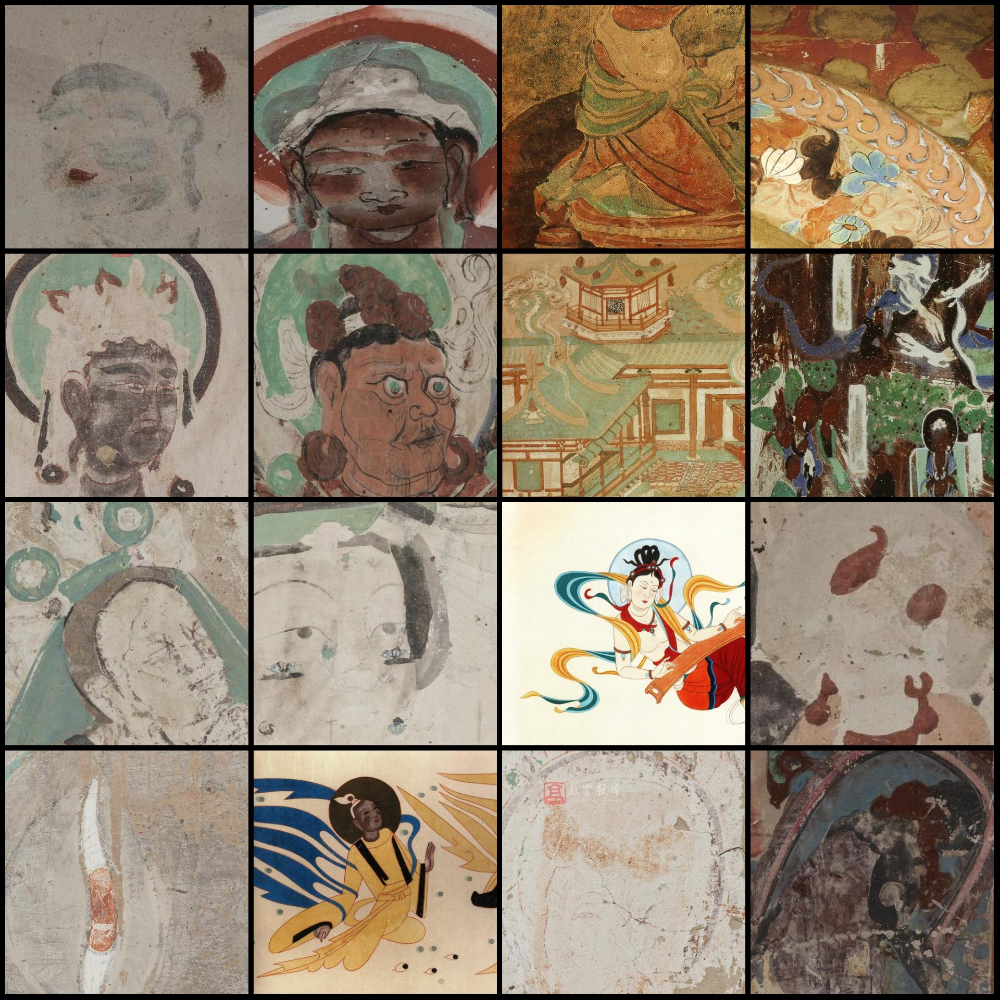
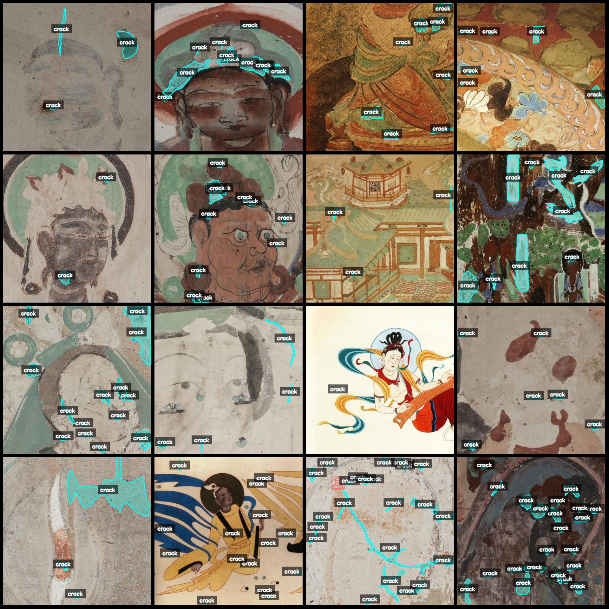
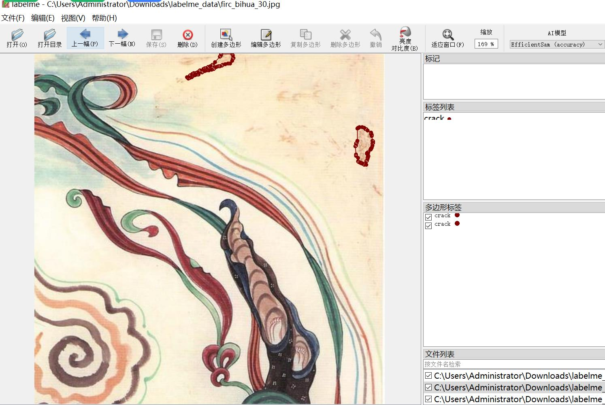

# Dataset of Broken Dunhuang Mosaic Paintings Identification and Segmentation

The dataset is in labelme format (without mask files, only including jpg images and corresponding json files). The image count (the number of jpg files) is 14210. The number of annotations (json 
files) is also 14210. The number of categories is 1.

The dataset format: labelme format (without mask files, just including jpg images and corresponding json files).
Number of images: 14210.
Number of annotations: 14210.
Number of category counts: 1.
Category name: "crack".
Number of boxes per category: 107283.
Total box count: 107283.
Annotation tool used: labelme = 5.5.0.
Image resolution: 512x512.
Annotation rules: Polygons are drawn around the categories.
Important note: You can open and edit the dataset with labelme, but the json dataset needs to be converted into a mask or yolo format or coco format for semantic segmentation or instance segmentation.
Special statement: This dataset does not guarantee the accuracy of the trained model or weight files.

Examples of images (randomly selected 16):
Annotation drawing results:
Labelme editing example:

## Images

Here is a pay link on Stripe ( https://buy.stripe.com/3cs8yP7sY87d0vu9AB ). Please contact me lonlonago@foxmail.com after funding $89, and I will send you a complete data files , thank you!

